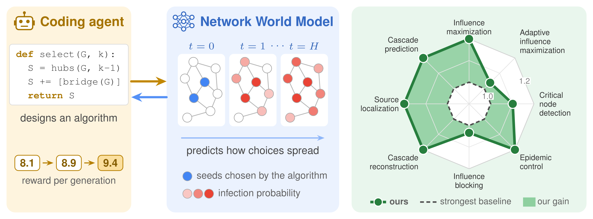
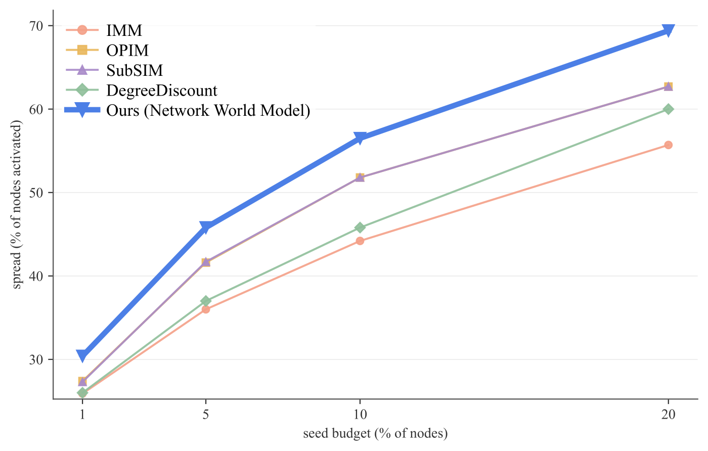
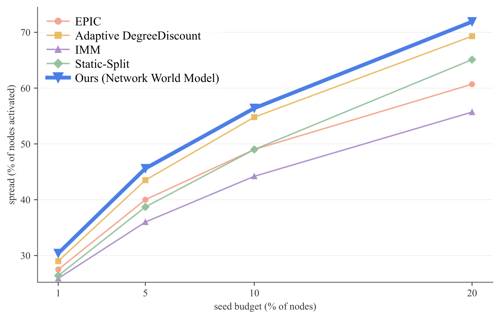
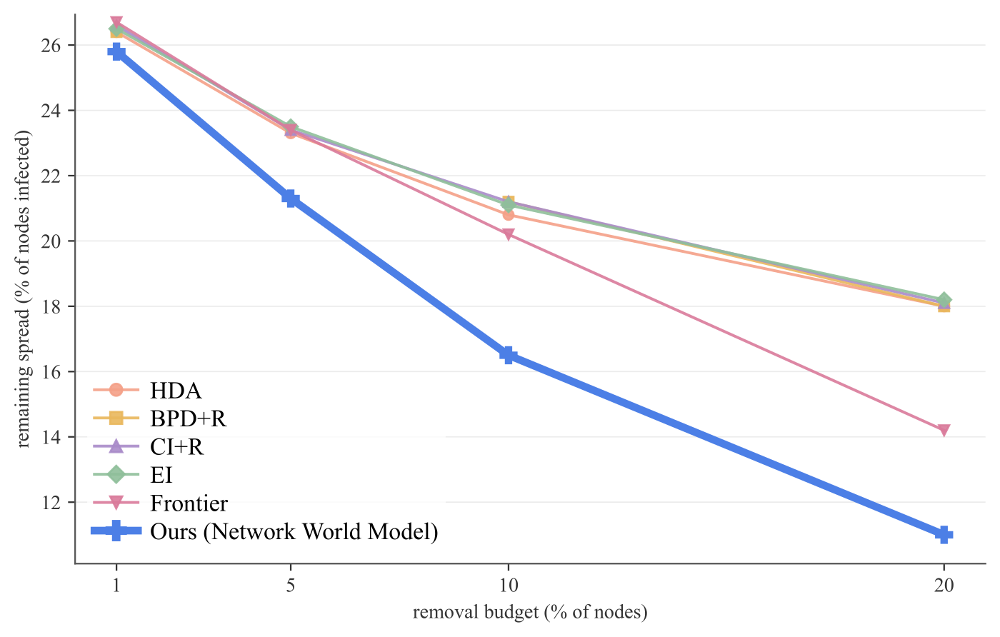
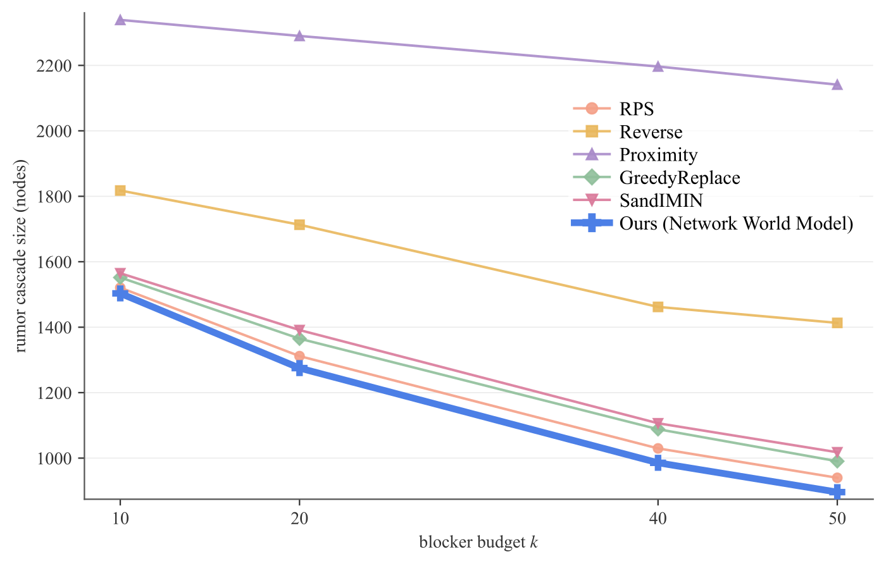
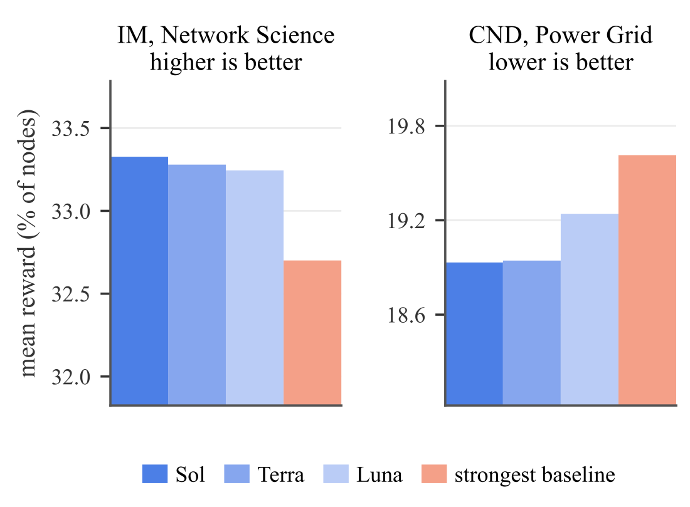
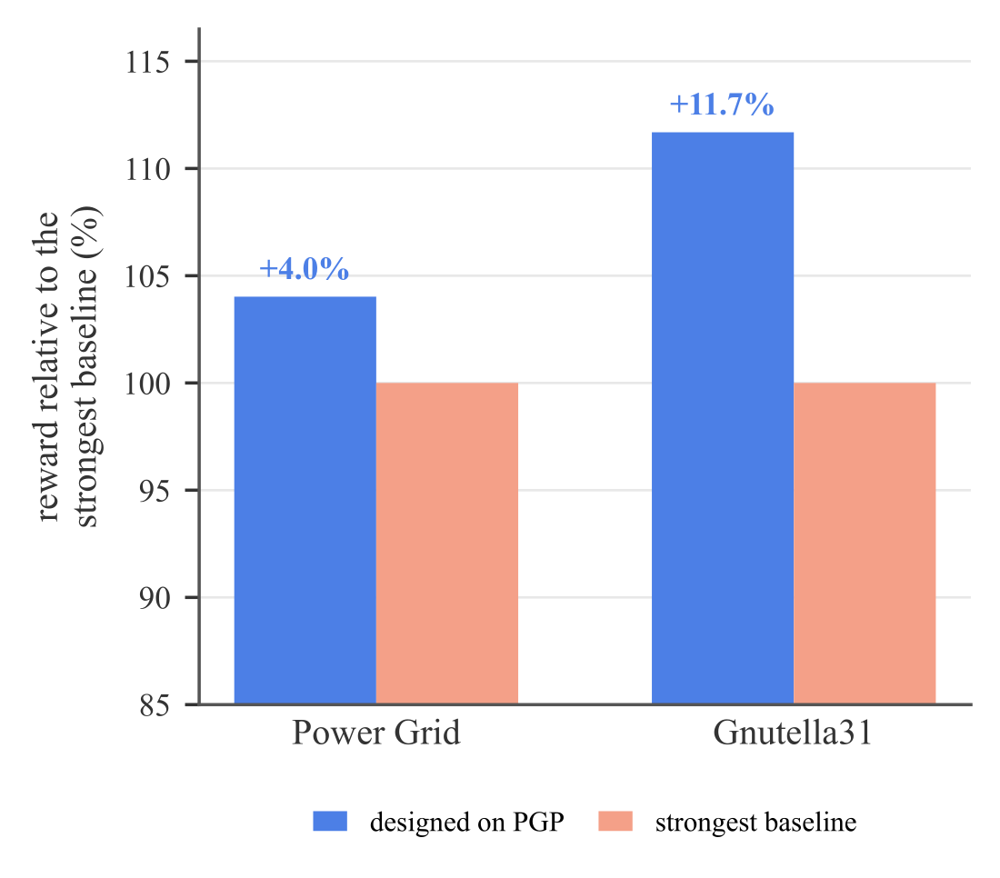
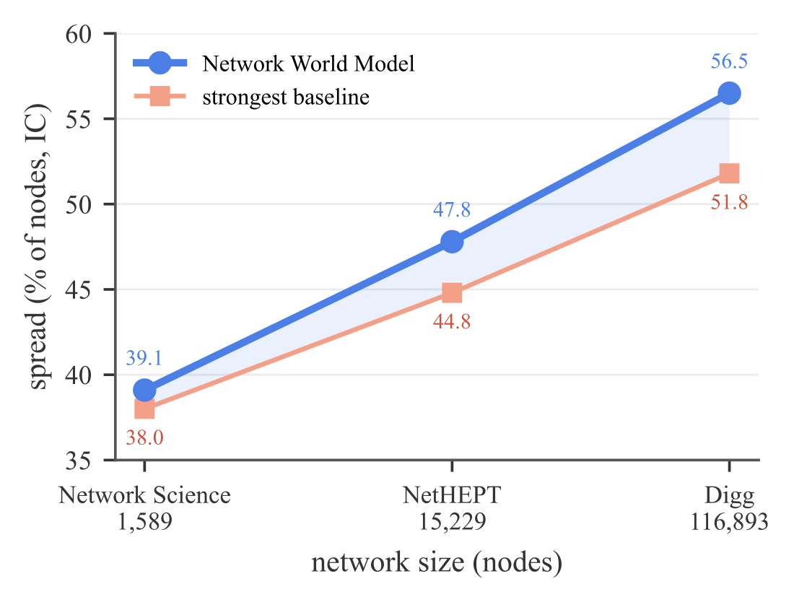
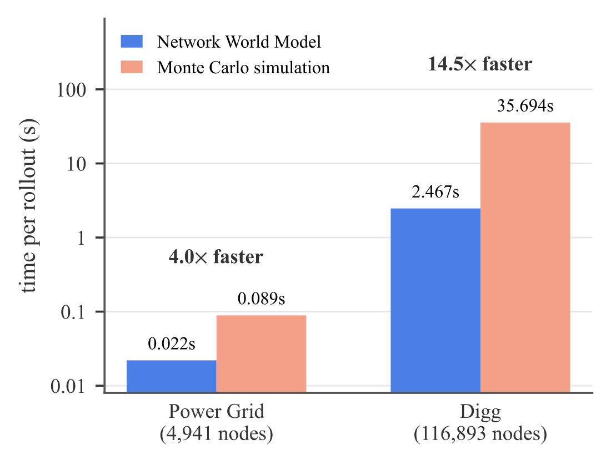
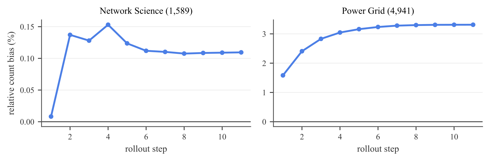

<div align="center">

# Network World Models as Environments for Algorithm Design on Complex Systems

**Rishab Alagharu**<sup>1</sup>, **Hongji Pu**<sup>2</sup>, **Zeeshan Memon**<sup>1</sup>, **Xinyuan Song**<sup>1</sup>, **Yuntong Hu**<sup>1</sup>, **Liang Zhao**<sup>1,&dagger;</sup>

<sup>1</sup>Emory University &nbsp;&nbsp;&nbsp; <sup>2</sup>University of Illinois Urbana-Champaign

<sup>&dagger;</sup>Corresponding author

[](https://rishabsa.github.io/NetworkWorldModel/)
[](https://arxiv.org/abs/XXXX.XXXXX)
[](https://arxiv.org/pdf/XXXX.XXXXX)
[](LICENSE)

</div>

<p align="center">
  
</p>

<p align="center"><em>A coding agent writes algorithms that choose interventions on a network, and a Network World Model rolls out how each choice unfolds, returning a reward, feedback, and probe answers the agent uses to improve the algorithm (left). Across eight tasks on complex networks, the agent-designed algorithms outperform the strongest baselines, averaged over budgets (right).</em></p>

## Abstract

World models, which simulate an environment and predict how it changes under actions, are increasingly used in real-world applications such as robotics. Complex systems call for the same tool because the effect of an action is not immediate. Seeding nodes for a campaign, or immunizing nodes against an epidemic, changes little on its own; what matters is the outcome that unfolds over the steps that follow. Designing an algorithm that selects such actions to maximize expected performance on a task is inherently iterative, and every candidate must be scored by the outcome it produces. Obtaining that outcome has relied on simulation, whose cost becomes a bottleneck when candidates are evaluated over many sampled trajectories. We propose an action-conditioned Network World Model that learns a network's diffusion dynamics under interventions over time, applies each action to the network, and predicts the outcome that follows. It serves as a fast evaluator inside an algorithm design loop in which a coding agent designs and refines executable algorithms using feedback from full rollouts, action-level credit, and counterfactual probes over alternative interventions. Across eight network tasks and five diffusion models, the designed algorithms match or exceed the strongest reported baseline in 138 of 141 settings while enabling up to 14.5 times faster rollouts than Monte Carlo simulation.

## Key Results

- **138 of 141 settings**: the designed algorithms match or exceed the strongest reported baseline across eight tasks and five diffusion models.
- **14.5&times; faster rollouts** than Monte Carlo simulation on Digg (116,893 nodes), and 4.0&times; on Power Grid. The world model pays for its training data after about five searches.
- **0.11% selection regret** against Monte Carlo selection on held-out SBM networks, with 90.2% pairwise preference accuracy.
- **Best at every budget** against four published LLM algorithm discovery systems (EoH, OpenEvolve, LLaMEA, ReEvo) on influence maximization and critical node detection.
- **Transfers and scales**: an algorithm designed on one network beats the strongest baseline on unseen networks of the same task, and the gain over the strongest baseline grows from Network Science to Digg.

## Method

A task instance fixes a network, its diffusion process, the constraints on actions, and a horizon $H$. An algorithm returns a plan of actions, and the plan is scored by the outcome the network reaches after $H$ steps. Computing that outcome exactly is #P-hard, so every candidate must be scored from many sampled trajectories, and simulation becomes the bottleneck of the search. We split the problem in two: learn a world model of the dynamics under interventions, then search for algorithms against it.

### Network World Model

An action changes the network in two ways: through an immediate effect that is known exactly, and through the diffusion that follows. The model applies the first and learns the second:

$$(\mathcal{G}_t^{+},\mathbf{s}_t^{+}) = T_{\mathrm{exo}}(\mathcal{G}_t,\mathbf{s}_t,a_t), \qquad \hat{\mathbf{s}}_{t+1} = f_{\theta}\big(\mathcal{G}_t^{+},\mathbf{s}_t^{+},\boldsymbol{\eta}(a_t)\big)$$

- **Exact interventions.** $T_{\mathrm{exo}}$ writes each action into the network and its state before diffusion takes its step: a seeded node, a removed node or edge, or a changed contact weight. Applying the intervention exactly removes intervention error from the rollout bound and tightens the selection guarantee below.
- **Action conditioning.** Features $\boldsymbol{\eta}(a_t)$ record which operation touched each node and edge and by how much, because distinct operations can leave similar post-intervention states. Message passing runs on the edited network, so removed edges carry no messages and downweighted edges contribute proportionally less.
- **Structured transition head.** The readout is constrained to the known form of the process, leaving only its parameters to learn. For a cascade, $g(\mathbf{h}_v) = 1-\prod_{u\to v}(1-q_{uv}z_u)$, where $q_{uv}$ is a learned transmission probability and $z_u$ marks the frontier. The repository implements a per-edge transmission head for IC, a threshold hazard head for LT, a two-cascade head for competitive diffusion, and a per-node compartment transition head for SIR, SIS and SEIR, on top of a GCN, GraphSAGE, GATv2, Graph Transformer or GCNII encoder.
- **Sampled rollouts.** Each step draws a state instead of carrying probabilities forward, which keeps every trajectory consistent with the process. A candidate and the current best are advanced under common random numbers, so their difference is not dominated by process variance.

The model is trained on $(\mathcal{G}, s_t, a_t, s_{t+1})$ transitions harvested from a trusted simulator, with Monte Carlo marginals as soft targets and counterfactual branches that apply different actions from the same state, so the model has to condition on the action.

### Algorithm Design Loop

Each round, an LLM coding agent writes an executable candidate algorithm, drawing on a library of classical algorithms for the task that it may reuse, combine, or extend. The Network World Model rolls out the candidate and the current best algorithm on the same $n$ sampled trajectories. Search operators favor exploration early and increasingly refine the current best algorithm as evidence accumulates. Beyond the task score, the model returns three kinds of feedback, one for each way a plan can be revised:

- **Rollout diagnostics**: how the process evolved under the plan: the score and its standard error, the nodes reached at each step, and the step at which spreading stops. They come from the scoring rollouts at no extra cost.
- **Action-level credit**: what each action contributed, measured by removing it under the same rollout seed, $c_j = \hat R_{\mathcal{E}}(\mathbf{a};\xi) - \hat R_{\mathcal{E}}(\mathbf{a}_{-j};\xi)$.
- **Counterfactual probes**: before writing the next candidate, the agent asks what-if questions about actions outside the plan, such as swapping a seed. One probe uses gradients from a mean-field rollout to flag promising and weak actions.

**Paired selection.** A fresh seed $\xi$ is drawn every round, and the candidate $\pi$ replaces the current best $\hat{\pi}$ only when its mean paired gain clears the standard error of the paired differences:

$$\Delta_i = R_i(\pi;\xi) - R_i(\hat{\pi};\xi), \qquad \Delta = \frac{1}{n}\sum_{i=1}^{n}\Delta_i, \qquad \text{accept if } \Delta > b = \frac{\mathrm{sd}(\Delta_1,\ldots,\Delta_n)}{\sqrt{n}}$$

Re-scoring the incumbent on the fresh seed every round keeps a favorable realization from carrying it forward. Generated algorithms are offline: they never call the world model themselves, and reach it only through the reward and feedback the harness computes.

### Reliability of World-Model-Based Selection

Suppose the one-step transition error of the Network World Model is at most $\epsilon$ over the states that algorithms in the search space $\Pi$ can reach within the horizon $H$, the task score has range at most $B_R$, and the returned algorithm $\hat{\pi}$ is $\eta_{\mathrm{search}}$-suboptimal under the learned evaluator. Then its selection regret under the true dynamics $P$ is bounded:

$$\mathrm{Reg}_P(\hat{\pi};\Pi) = J_P(\pi^\star) - J_P(\hat{\pi}) \le 2B_R H\epsilon + \eta_{\mathrm{search}}$$

Exact reproduction of every rollout is not required for reliable selection: the downstream loss is controlled by the accumulated transition error and the search error. The paper also proves that pairwise rankings are preserved and that the best algorithm is recovered exactly under a sufficient selection margin.

## Tasks

One world model design and one search loop cover three problem families: five tasks intervene on a spreading process, two infer its hidden cause, and one forecasts real cascades.

| Task | `--task` | Family | Dynamics | What the algorithm returns | Metric |
| --- | --- | --- | --- | --- | --- |
| Influence maximization | `influence_maximization` | intervention | IC, LT | a seed set | final spread (&uarr;) |
| Adaptive influence maximization | `adaptive_online_im` | intervention | IC, LT | seeds committed over rounds, each after observing the last | final spread (&uarr;) |
| Critical node detection | `critical_node_detection` | intervention | IC, LT | nodes to remove ahead of an outbreak | final infected (&darr;) |
| Influence blocking | `influence_blocking` | intervention | IC, CLT | counter-seeds, node or arc blocks, or weight cuts against a rumor | final rumor size (&darr;) |
| Epidemic control | `epidemic_control` | intervention | SIR, SIS, SEIR | vaccinations, quarantines, arc cuts, or contact reductions | attack rate (&darr;) |
| Source localization | `source_localization` | inverse | IC, LT | the source set behind an observed spread | consistency with the observation (&uarr;) |
| Cascade reconstruction | `cascade_reconstruction` | inverse | IC, LT | the hidden history: who was infected, when, and by whom | likelihood of the decoded history (&uarr;) |
| Cascade prediction | `cascade_prediction` | forecasting | real cascades | the final size of a partly observed cascade | MSLE (&darr;) |

Cascade prediction is the one task that runs no simulator: it replays real cascades from platform logs, so it tests how well the diffusion assumptions hold on real data.

## Results

Every returned algorithm and every baseline is replayed independently on the trusted Monte Carlo simulator with 200 samples, so the world model used during the search never scores its own results. The design loop runs $G = 10$ rounds with $n = 200$ sampled rollouts per evaluation, horizon $H = 10$, and six probes per round, with GPT-5.6 Sol as the coding agent. Baselines include the classical algorithms of each task's literature, published implementations run from their own repositories, and published LLM algorithm discovery systems.

### Designed algorithms against the strongest baselines

The designed algorithms improve on the strongest existing method in all eight tasks and match or exceed the strongest reported baseline in 138 of 141 settings. Each cell reports IC / LT (IC / CLT for influence blocking, SIR / SIS for epidemic control). Bold marks the best value, and n/a marks an out-of-memory error or a timeout. Expand a task to see its table.

<details>
<summary><b>Influence maximization</b> (IC / LT): spread, % of nodes activated (↑)</summary>

**Network Science (1,589 nodes)**

| Method | 1% | 5% | 10% | 20% |
| --- | :---: | :---: | :---: | :---: |
| IMM | 8.7 / 10.9 | 24.8 / 30.2 | 38.0 / 45.1 | 59.2 / 68.5 |
| OPIM | 8.8 / 10.8 | 24.2 / 29.5 | 37.7 / 45.3 | 58.3 / 67.4 |
| SubSIM | 8.7 / 10.7 | 24.3 / 29.1 | 37.3 / 45.0 | 57.8 / 68.5 |
| DeepIM | 4.8 / 5.3 | 15.3 / 20.0 | 27.7 / 32.9 | 45.8 / 53.0 |
| DegreeDiscount | 8.3 / 10.7 | 23.7 / 29.7 | 36.3 / 44.5 | 55.0 / 65.5 |
| **Network World Model** | **8.9** / **11.3** | **25.3** / **30.9** | **39.1** / **46.8** | **60.1** / **69.3** |

**Digg (116,893 nodes)**

| Method | 1% | 5% | 10% | 20% |
| --- | :---: | :---: | :---: | :---: |
| IMM | 25.9 / 47.0 | 36.0 / 60.9 | 44.2 / 69.7 | 55.7 / 79.6 |
| OPIM | 27.4 / 50.5 | 41.6 / 68.4 | 51.8 / 77.6 | 62.7 / 85.5 |
| SubSIM | 27.3 / 50.1 | 41.7 / 68.4 | 51.8 / 77.7 | 62.7 / 85.4 |
| DeepIM | n/a | n/a | n/a | n/a |
| DegreeDiscount | 26.0 / 49.6 | 37.0 / 62.7 | 45.8 / 70.0 | 60.0 / 81.6 |
| **Network World Model** | **30.4** / **56.8** | **45.8** / **73.2** | **56.5** / **83.1** | **69.4** / **93.5** |

</details>

<details>
<summary><b>Adaptive influence maximization</b> (IC / LT): spread, % of nodes activated (↑)</summary>

**Network Science (1,589 nodes)**

| Method | 1% | 5% | 10% | 20% |
| --- | :---: | :---: | :---: | :---: |
| EPIC | 8.4 / 10.8 | 23.1 / 28.7 | 34.6 / 41.5 | 52.9 / 62.3 |
| Adaptive DegreeDiscount | 8.2 / 10.8 | 23.6 / 30.2 | 36.5 / 45.8 | 56.9 / 69.3 |
| IMM | 8.7 / 10.9 | 24.8 / 30.2 | 38.0 / 45.1 | 59.2 / 68.5 |
| Static-Split | 8.3 / 10.7 | 24.1 / 30.3 | 37.5 / 45.9 | 58.1 / 69.3 |
| **Network World Model** | **8.9** / **11.3** | **25.2** / **30.9** | **39.1** / **46.8** | **60.0** / **69.4** |

**Digg (116,893 nodes)**

| Method | 1% | 5% | 10% | 20% |
| --- | :---: | :---: | :---: | :---: |
| EPIC | 27.5 / 48.4 | 40.0 / 65.8 | 49.0 / 74.0 | 60.7 / 82.4 |
| Adaptive DegreeDiscount | 29.0 / 54.2 | 43.5 / 68.9 | 54.8 / 79.4 | 69.3 / 93.6 |
| IMM | 25.9 / 47.0 | 36.0 / 60.9 | 44.2 / 69.7 | 55.7 / 79.6 |
| Static-Split | 26.4 / 49.6 | 38.7 / 64.5 | 49.0 / 73.8 | 65.1 / 87.5 |
| **Network World Model** | **30.4** / **56.8** | **45.6** / **73.2** | **56.4** / **83.0** | **71.9** / **94.0** |

</details>

<details>
<summary><b>Critical node detection</b> (IC / LT): remaining spread, % of nodes infected (↓)</summary>

**Power Grid (4,941 nodes)**

| Method | 1% | 5% | 10% | 20% |
| --- | :---: | :---: | :---: | :---: |
| HDA | 26.5 / 28.9 | 24.0 / 27.1 | 21.8 / 25.4 | 18.6 / 22.3 |
| BPD+R | 26.7 / 29.1 | 24.1 / 27.5 | 21.9 / 25.8 | 18.5 / 22.4 |
| CI+R | 26.7 / 29.0 | 24.1 / 27.3 | 21.9 / 25.7 | 18.5 / 22.3 |
| EI | 26.8 / 29.2 | 24.5 / 27.9 | 22.1 / 26.0 | 19.1 / 23.2 |
| Frontier | 26.3 / 28.6 | 22.7 / 25.0 | 18.7 / 20.4 | 10.7 / **10.7** |
| **Network World Model** | **26.2** / **28.2** | **22.0** / **24.1** | **17.3** / **19.6** | **10.2** / **10.7** |

**PGP (10,680 nodes)**

| Method | 1% | 5% | 10% | 20% |
| --- | :---: | :---: | :---: | :---: |
| HDA | 26.4 / 31.9 | 23.3 / 28.5 | 20.8 / 25.6 | 18.0 / 21.6 |
| BPD+R | 26.4 / 32.0 | n/a | 21.2 / 25.8 | 18.0 / 21.6 |
| CI+R | 26.6 / 32.0 | 23.4 / 28.5 | 21.2 / 25.9 | 18.1 / 21.6 |
| EI | 26.5 / 32.0 | 23.5 / 28.8 | 21.1 / 25.9 | 18.2 / 22.2 |
| Frontier | 26.7 / 32.0 | 23.4 / 27.9 | 20.2 / 23.6 | 14.2 / 14.5 |
| **Network World Model** | **25.8** / **31.1** | **21.3** / **26.7** | **16.5** / **21.5** | **11.0** / **13.0** |

</details>

<details>
<summary><b>Influence blocking</b> (IC / CLT): rumor cascade size (nodes) (↓)</summary>

**Email-EU (1,005 nodes)**

| Method | 10 | 20 | 40 | 50 |
| --- | :---: | :---: | :---: | :---: |
| RPS | 60.2 / **70.9** | 47.4 / 56.7 | 35.0 / 42.8 | 31.9 / 39.1 |
| Reverse | 61.0 / 73.1 | 49.2 / 57.9 | 37.2 / 44.8 | 34.5 / 42.1 |
| Proximity | 63.1 / 74.9 | 52.4 / 61.2 | 39.6 / 47.7 | 36.3 / 44.2 |
| GreedyReplace | 92.2 / 162.3 | 77.2 / 163.5 | 60.1 / 157.3 | 54.8 / 154.9 |
| SandIMIN | 92.5 / 160.0 | 77.4 / 158.7 | 63.7 / 157.8 | 54.4 / 150.9 |
| **Network World Model** | **59.4** / 71.7 | **46.3** / **55.4** | **34.5** / **42.2** | **31.0** / **38.7** |

**Gnutella24 (26,518 nodes)**

| Method | 10 | 20 | 40 | 50 |
| --- | :---: | :---: | :---: | :---: |
| RPS | 1520.6 / 1625.3 | 1311.6 / 1380.6 | 1029.6 / 1076.5 | 939.8 / 980.4 |
| Reverse | 1817.6 / 1961.8 | 1713.1 / 1856.4 | 1462.0 / 1587.7 | 1413.1 / 1535.7 |
| Proximity | 2338.9 / 2531.6 | 2289.9 / 2481.1 | 2196.5 / 2379.0 | 2141.1 / 2319.7 |
| GreedyReplace | 1551.8 / 1640.5 | 1364.9 / 1449.2 | 1088.2 / 1211.8 | 990.4 / 1072.4 |
| SandIMIN | 1564.9 / 1633.3 | 1391.2 / 1456.3 | 1106.4 / 1173.9 | 1017.8 / 1096.9 |
| **Network World Model** | **1503.3** / **1582.3** | **1275.0** / **1333.8** | **985.6** / **1023.0** | **896.0** / **924.7** |

</details>

<details>
<summary><b>Epidemic control</b> (SIR / SIS): attack rate, % of nodes ever infected (↓)</summary>

**Infectious SocioPatterns (10,972 nodes)**

| Method | 1% | 5% | 10% | 20% |
| --- | :---: | :---: | :---: | :---: |
| DAVA | **19.9** / 23.0 | **7.4** / 8.3 | **1.0** / **1.0** | **1.0** / **1.0** |
| NetShield+ | 21.2 / 24.9 | 17.3 / 20.6 | 12.8 / 15.6 | 7.4 / 8.9 |
| GreedyWalk | 20.9 / 24.6 | 16.5 / 19.8 | 12.3 / 14.9 | 7.0 / 8.5 |
| EI | 20.7 / 24.4 | 16.3 / 19.3 | 11.5 / 13.6 | 8.1 / 9.5 |
| CI | 20.7 / 24.3 | 16.1 / 18.9 | 12.4 / 14.6 | 6.9 / 8.1 |
| **Network World Model** | 20.4 / **19.5** | 12.2 / **4.1** | **1.0** / **1.0** | **1.0** / **1.0** |

**Oregon1 (10,670 nodes)**

| Method | 1% | 5% | 10% | 20% |
| --- | :---: | :---: | :---: | :---: |
| DAVA | 7.9 / 9.6 | **1.0** / **1.0** | **1.0** / **1.0** | **1.0** / **1.0** |
| NetShield+ | 4.3 / 5.4 | 2.1 / 2.3 | 1.8 / 1.9 | 1.6 / 1.7 |
| GreedyWalk | 4.8 / 5.9 | 2.5 / 2.8 | 1.9 / 2.1 | 1.6 / 1.7 |
| EI | 4.2 / 5.2 | 2.0 / 2.1 | 1.7 / 1.8 | 1.6 / 1.6 |
| CI | 4.2 / 5.2 | 2.0 / 2.1 | 1.7 / 1.8 | 1.6 / 1.6 |
| **Network World Model** | **2.4** / **4.3** | **1.0** / **1.0** | **1.0** / **1.0** | **1.0** / **1.0** |

**Brightkite (58,228 nodes)**

| Method | 1% | 5% | 10% | 20% |
| --- | :---: | :---: | :---: | :---: |
| DAVA | 40.9 / 47.1 | n/a | n/a | n/a |
| NetShield+ | 24.1 / 29.4 | 8.5 / 10.5 | 4.5 / 5.4 | 2.7 / 3.0 |
| GreedyWalk | **23.2** / 28.4 | 8.4 / 10.5 | 4.6 / 5.5 | 2.8 / 3.1 |
| EI | 23.5 / 28.7 | 8.7 / 10.9 | 4.5 / 5.3 | 2.8 / 3.1 |
| CI | 26.0 / 31.1 | 10.2 / 12.3 | 4.7 / 5.5 | 2.7 / 3.0 |
| **Network World Model** | **23.2** / **24.5** | **1.4** / **1.5** | **1.0** / **1.0** | **1.0** / **1.0** |

</details>

<details>
<summary><b>Source localization</b> (IC / LT): consistency of the recovered sources with the observation, 0 is perfect (↑)</summary>

| Method | Cora-ML (2,810 nodes) | Power Grid (4,941 nodes) | Deezer (47,538 nodes) |
| --- | :---: | :---: | :---: |
| LPSI | −0.173 / −0.130 | −0.106 / −0.100 | −0.176 / −0.174 |
| Rumor Centrality | −0.237 / −0.257 | −0.242 / −0.260 | −0.190 / −0.200 |
| Dynamic Age | −0.200 / −0.183 | −0.234 / −0.274 | −0.178 / −0.183 |
| Infected-Degree | −0.173 / −0.154 | −0.116 / −0.119 | −0.178 / −0.186 |
| SL-VAE | −0.370 / −0.437 | −0.306 / −0.323 | −0.314 / −0.240 |
| **Network World Model** | **−0.139** / **−0.106** | **−0.080** / **−0.073** | **−0.147** / **−0.145** |

</details>

<details>
<summary><b>Cascade reconstruction</b> (IC / LT): referee reward of the decoded history, 0 is perfect (↑)</summary>

| Method | UCI Students (1,266 nodes) | CA-GrQc (5,242 nodes) | RT-Pol (18,470 nodes) |
| --- | :---: | :---: | :---: |
| Reports | −0.852 / −0.946 | −0.791 / −0.692 | −1.252 / −1.068 |
| Steiner Tree | −0.901 / −0.978 | −0.798 / −0.753 | −2.618 / −2.076 |
| Jordan-Backward | −0.852 / −0.946 | −0.791 / −0.692 | −1.252 / −1.068 |
| DHREC | −1.464 / −1.525 | −1.175 / −1.176 | −2.471 / −2.594 |
| CRI | −0.885 / −0.995 | −1.106 / −1.151 | −0.785 / −0.782 |
| **Network World Model** | **−0.675** / **−0.717** | **−0.566** / **−0.566** | **−0.391** / **−0.373** |

</details>

<details>
<summary><b>Cascade prediction</b> : MSLE at the prediction horizon (↓)</summary>

| Method | APS (30,000 nodes) | Taoke (29,711 nodes) | Digg (5,000 nodes) |
| --- | :---: | :---: | :---: |
| Persistence | 0.288 | 1.101 | 4.222 |
| Szabo-Huberman | 0.098 | 0.716 | 0.834 |
| Hawkes | 0.141 | 0.957 | 2.744 |
| RPP | 0.116 | 1.009 | 3.283 |
| Weng-Communities | 0.196 | 0.850 | 1.142 |
| **Network World Model** | **0.078** | **0.544** | **0.774** |

</details>


### Gains hold across budgets

<p align="center">
  
  
  
  
</p>

<p align="center"><em>Performance across intervention budgets under IC: influence maximization and adaptive influence maximization on Digg (top, higher is better), critical node detection on PGP and influence blocking on Gnutella24 (bottom, lower is better).</em></p>

### Against LLM algorithm discovery systems

EoH, OpenEvolve (the open-source implementation of AlphaEvolve), LLaMEA, and ReEvo each run their own search loop, prompts, and published defaults on the same problem, with a fitness function on the exact simulator and the same coding model. None of them sees the Network World Model. The design loop is best at every budget on both tasks, and none of the four systems reaches the strongest classical baseline on Network Science at any budget.

| Method | IM 1% | IM 5% | IM 10% | IM 20% | CND 1% | CND 5% | CND 10% | CND 20% |
| --- | :---: | :---: | :---: | :---: | :---: | :---: | :---: | :---: |
| EoH | 5.5 | 19.5 | 32.5 | 54.6 | 26.6 | 23.4 | 19.4 | 14.3 |
| OpenEvolve | 5.1 | 21.9 | 36.8 | 50.8 | 26.6 | 23.8 | 21.4 | 17.7 |
| LLaMEA | 6.1 | 21.1 | 34.9 | 56.2 | 26.6 | 23.4 | 19.5 | 14.3 |
| ReEvo | 6.6 | 22.3 | 35.5 | 57.0 | 26.6 | 23.5 | 19.6 | 15.0 |
| **Network World Model** | **8.9** | **25.3** | **39.0** | **60.0** | **26.2** | **22.0** | **17.3** | **10.2** |


Influence maximization on Network Science (spread, % of nodes activated, &uarr;) and critical node detection on Power Grid (remaining spread, % of nodes infected, &darr;), under IC. All rows use GPT-5.6 Sol.

### Robustness, transfer, scale and cost

<p align="center">
  
  
  
  
</p>

- **Coding model.** Repeating the search with GPT-5.6 Sol, Terra, and Luna, the three finish within 0.1 points of one another on Network Science and within 0.3 points on Power Grid, averaged over budgets, and each beats the strongest baseline (top left).
- **Transfer.** The critical node detection algorithm designed on PGP, replayed unmodified, beats the strongest baseline on Power Grid by 4.0% and on Gnutella31 by 11.7% (top right). Transferred algorithms stay within 0.1 percentage points of algorithms designed directly on the target network.
- **Scale.** For influence maximization under IC at the 10% budget, the designed algorithm stays ahead of the strongest baseline from Network Science to Digg, and the gain grows from 1 to 4% on Network Science to 7 to 12% on Digg (bottom left).
- **Cost.** One world model rollout is 4.0&times; faster than Monte Carlo simulation on Power Grid and 14.5&times; faster on Digg (bottom right). Building the training set costs 38,800 simulator episodes once, while a simulator-based search needs 7,800 episodes every time it runs.

### How accurate is the world model?

One-step $\Delta$F1 ranges from 0.87 to 0.99 for IC, LT, and CLT and from 0.85 to 0.86 for SIR and SIS, with Brier scores of at most 0.0006. Free-running rollouts stay within 2.2% of the trusted simulator at the horizon, except under LT, where the model undercounts by 6.0%.

| Dynamics | $\Delta$F1 (&uarr;) | Brier (&darr;) | Rollout bias (%) |
| --- | :---: | :---: | :---: |
| IC | 0.8738 | 0.0003 | +0.1 |
| LT | 0.9926 | 0.0003 | &minus;6.0 |
| CLT | 0.9880 | 0.0001 | &minus;2.2 |
| SIR | 0.8565 | 0.0006 | +0.5 |
| SIS | 0.8461 | 0.0006 | &minus;0.1 |

Prediction and rollout quality on Network Science (IC, LT), Email-EU (CLT), and Oregon1 (SIR, SIS).

For search, what matters is that the model orders candidates the way the true dynamics would. On held-out SBM and BA networks, it agrees with the trusted simulator on 90.2% and 86.1% of candidate pairs, with selection regret of 0.11% and 0.13%. On Watts-Strogatz networks, a topology shift, preference accuracy stays at 86.0% and regret at 1.18%.

| Network family | Preference accuracy [95% CI] | WM regret (%) | Random regret (%) |
| --- | :---: | :---: | :---: |
| SBM (in distribution) | 0.902 [0.890, 0.914] | 0.11 | 10.27 |
| BA (in distribution) | 0.861 [0.818, 0.902] | 0.13 | 12.03 |
| WS (topology shift) | 0.860 [0.832, 0.887] | 1.18 | 10.07 |

<p align="center">
  
</p>

<p align="center"><em>Relative count bias of the free-running sampled rollout by step on the 50 held-out episodes of the main runs. The bias settles within the first few steps and does not grow, so one-step error does not compound over a rollout.</em></p>

## Datasets

The datasets used in the experiments, ordered by node count. Directed networks quote arcs. Every loader downloads its data to `data/raw/<dataset>/` on first use.

| Dataset | `--dataset` | Nodes | Edges | Tasks |
| --- | --- | ---: | ---: | --- |
| Email-EU | `email_eu_core` | 1,005 | 24,929 | Influence blocking |
| UCI Students | `uci_students` | 1,266 | 6,451 | Cascade reconstruction |
| Network Science | `netscience` | 1,589 | 2,742 | Influence maximization, adaptive influence maximization |
| Cora-ML | `cora_ml` | 2,810 | 7,981 | Source localization |
| Power Grid | `power_grid` | 4,941 | 6,594 | Critical node detection, source localization |
| CA-GrQc | `ca_grqc` | 5,242 | 14,484 | Cascade reconstruction |
| Oregon1 | `oregon1` | 10,670 | 22,002 | Epidemic control |
| PGP | `pgp` | 10,680 | 24,316 | Critical node detection |
| Infectious SocioPatterns | `infectious_sociopatterns` | 10,972 | 44,517 | Epidemic control |
| NetHEPT | `nethept` | 15,229 | 62,752 | Influence maximization, adaptive influence maximization |
| RT-Pol | `rt_pol` | 18,470 | 48,053 | Cascade reconstruction |
| Gnutella24 | `p2p_gnutella24` | 26,518 | 65,369 | Influence blocking |
| Cit-HepTh | `cit_hepth` | 27,769 | 352,768 | Influence blocking |
| Taoke | `taoke` | 29,711 | 95,012 | Cascade prediction |
| Deezer | `deezer` | 47,538 | 222,887 | Source localization |
| Brightkite | `brightkite` | 58,228 | 214,078 | Epidemic control |
| Gnutella31 | `p2p_gnutella` | 62,561 | 147,878 | Critical node detection |
| Digg | `digg` | 116,893 | 2,011,447 | Influence maximization, adaptive influence maximization |
| Digg (cascades) | `digg_cascades` | 279,630 | 1,731,653 | Cascade prediction |
| APS | `casflow_aps` | 616,316 | 3,304,400 | Cascade prediction |

For the three cascade-prediction corpora, the counts describe the full underlying network, while the runs replay a subsample restricted to the most active participants. Many more loaders are available in `data/datasets/`, together with the synthetic families `er`, `ba`, `ws`, `sbm`, `powerlaw_cluster` and `kronecker`. Each loader documents its source and how the network is built.

## Setup

The code is tested on Python 3.13. Create an environment and install the dependencies with [uv](https://docs.astral.sh/uv/):

```bash
uv venv --python 3.13
uv pip install -r requirements.txt
```

The coding agent talks to any OpenAI-compatible chat completions endpoint. Put its address and key in a `.env` file at the repository root, which is gitignored:

```bash
GATEWAY_BASE_URL=https://api.openai.com/v1
CHATGPT_GATEWAY_TOKEN=<your API key>
# Only needed for models whose name starts with claude-
CLAUDE_GATEWAY_TOKEN=<your API key>
```

The model is chosen with `--llm-model`, and the pipeline checks that the endpoint serves it before any stage runs.

The published baselines are optional. Each one is cloned into `baselines/external/` with its own virtual environment, so its dependency pins never collide with ours:

```bash
uv run python -m baselines.setup_baselines --list
uv run python -m baselines.setup_baselines --only opim subsim
uv run python -m baselines.setup_baselines --all
```

## Running

One command runs a whole experiment: it generates the transitions, trains the Network World Model, runs every baseline and every agent arm at every budget, then writes the plots and a report. Finished stages are detected on disk, so a stopped run resumes where it left off.

```bash
# Influence maximization on Network Science: two library baselines, one
# published repository, and the design loop scored by the world model
uv run python -m pipeline.run --task influence_maximization --dataset netscience \
    --baselines imm degree_discount external:opim \
    --arms routing evolve_free@oracle evolve_free@world_model \
    --budget-pcts 1 5 10 20
```

Every task runs through the same entry point, and the task registry supplies its dynamics, action space and budgets:

```bash
uv run python -m pipeline.run --task critical_node_detection --dataset power_grid
uv run python -m pipeline.run --task influence_blocking --dataset email_eu_core
uv run python -m pipeline.run --task epidemic_control --dataset oregon1
uv run python -m pipeline.run --task source_localization --dataset cora_ml
uv run python -m pipeline.run --task cascade_reconstruction --dataset uci_students
uv run python -m pipeline.run --task cascade_prediction --dataset taoke
```

An agent arm is written `<method>_<mode>@<evaluator>`. The evaluator is the only thing that changes between arms, so the arms can be compared directly:

| Arm | Evaluator inside the design loop |
| --- | --- |
| `evolve_free@native` | one real simulator episode per candidate |
| `evolve_free@monte_carlo` | Monte Carlo simulation |
| `evolve_free@oracle` | the exact batched simulator |
| `evolve_free@world_model` | the Network World Model |
| `routing` | the LLM picks one library algorithm instead of writing code |

Useful flags for controlling a run:

```bash
# Search once at a 10% budget and replay the winner at the other budgets
uv run python -m pipeline.run --task influence_maximization --dataset nethept --search-budget pct10

# Rerun only the plots and the report of a finished run
uv run python -m pipeline.run --task influence_maximization --dataset netscience --start-stage plots

# Rerun one stage from scratch
uv run python -m pipeline.run --task influence_maximization --dataset netscience \
    --start-stage agent --end-stage agent --force

# Keep several variants of one task and dataset side by side
uv run python -m pipeline.run --task influence_maximization --dataset netscience \
    --run gcnii --wm-model gcnii
```

Everything a run produces is written to `results/<task>/<dataset>/<run>/`:

```
results/<task>/<dataset>/<run>/
├── data/          # generated transitions and the network store
├── world_model/   # checkpoints and training results
├── agent/         # one JSON per budget and arm, with the returned program
├── plots/         # figures
├── report.md      # results tables and world model diagnostics
└── pipeline.json  # stage status and configuration
```

Each task ships a runnable self-check of its contract:

```bash
uv run python -m coding_agent.check_containment
uv run python -m coding_agent.check_source_localization
uv run python -m coding_agent.check_influence_blocking
uv run python -m coding_agent.check_cascade_reconstruction
uv run python -m coding_agent.check_epidemic_control
uv run python -m coding_agent.check_cascade_prediction
uv run python -m coding_agent.check_adaptive
uv run python -m baselines.check_discovery
```

## Project structure

```
.
├── pipeline/                   # end-to-end driver
│   ├── run.py                  # one command: data, train, agent, plots, report
│   ├── tasks.py                # task registry: objective, dynamics, actions, budgets
│   ├── conditions.py           # agent arms and their evaluators
│   ├── layout.py               # results/<task>/<dataset>/<run>/ paths
│   ├── plots.py                # figures
│   ├── report.py               # report.md
│   └── summary.py              # cross-run summaries
├── data/                       # simulators, loaders and transition generation
│   ├── generate_wm_data.py     # simulate episodes and write transitions
│   ├── wm_simulator.py         # IC and LT dynamics and the five action ops
│   ├── wm_competitive.py       # two-cascade dynamics for influence blocking
│   ├── wm_epidemic.py          # SIR, SIS and SEIR dynamics
│   ├── wm_cascades.py          # replay of real cascades for cascade prediction
│   ├── wm_graphs.py            # network providers and synthetic families
│   ├── wm_actions.py           # seed selectors, action injection, counterfactuals
│   └── datasets/               # one loader per dataset
├── world_model/                # the Network World Model
│   ├── wm_data.py              # node features, network inputs, batching
│   ├── wm_model.py             # world model, backbone registry, structured heads
│   ├── model/                  # GCN, GraphSAGE, GATv2, Graph Transformer, GCNII
│   ├── train_wm.py             # teacher-forced training
│   ├── wm_eval.py              # one-step, rollout and planning evaluation
│   ├── wm_metrics.py           # metric primitives
│   └── scorer.py               # loads a checkpoint and scores candidate plans
├── coding_agent/               # the algorithm design loop
│   ├── agent.py                # LLM client
│   ├── run.py                  # runs one arm on one task
│   ├── methods/                # search methods, including evolve
│   ├── prompts.py              # agent prompts
│   ├── executor.py             # restricted execution of generated algorithms
│   ├── feedback.py             # task score and feedback
│   ├── diagnostics.py          # rollout diagnostics
│   ├── credit.py               # action-level credit
│   ├── probes.py               # counterfactual probes
│   ├── envs/                   # evaluator environments: Monte Carlo, multi-round, world model
│   ├── tools/                  # callable library of classical algorithms per task
│   └── check_*.py              # per-task self-checks
├── baselines/                  # published implementations and discovery systems
│   ├── registry.py             # every published baseline and how it runs
│   ├── setup_baselines.py      # clone and install into baselines/external/
│   ├── run_baseline.py         # run one baseline and score it on the referee
│   ├── discovery.py            # LLM algorithm discovery systems
│   ├── score_program.py        # fitness process for the discovery systems
│   └── drivers/                # entry points for repositories without a usable CLI
├── requirements.txt
└── ruff.toml
```


## Citation

If you find this work useful, please cite:

```bibtex
@article{alagharu2026network,
  title={Network World Models as Environments for Algorithm Design on Complex Systems},
  author={Alagharu, Rishab and Pu, Hongji and Memon, Zeeshan and Song, Xinyuan and Hu, Yuntong and Zhao, Liang},
  journal={arXiv preprint arXiv:XXXX.XXXXX},
  year={2026}
}
```

## License

This project is released under the MIT License; see [LICENSE](LICENSE). The project page is adapted from the [Academic Project Page Template](https://github.com/eliahuhorwitz/Academic-project-page-template), and its layout remains under the [Creative Commons Attribution-ShareAlike 4.0 International License](http://creativecommons.org/licenses/by-sa/4.0/).
